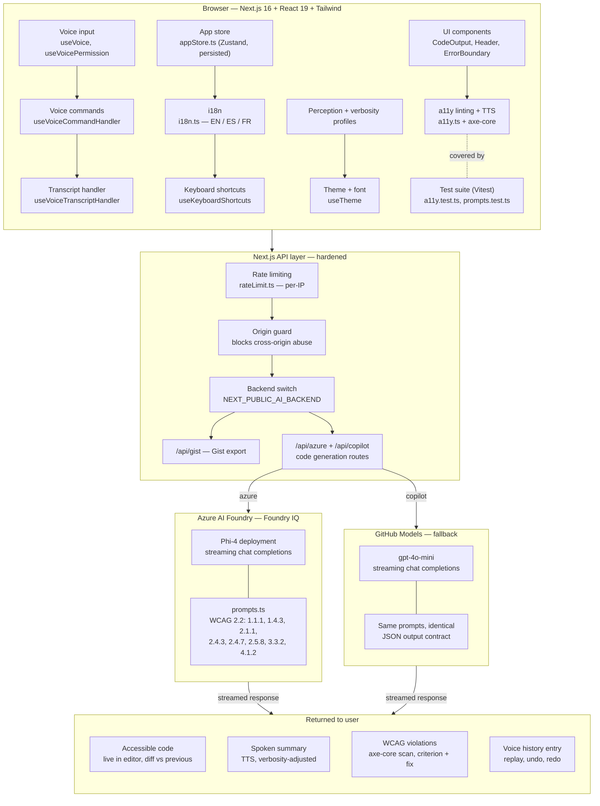

Created by 2302Gagan

# DevBuddy — Accessible AI Coding Assistant

> Voice-driven, accessibility-first coding assistant powered by Azure AI Foundry (Phi-4).
> Built for developers with RSI, visual impairments, or motor disabilities.

**Microsoft Agents League Hackathon 2026 — Creative Apps Track**

---

## What it does

DevBuddy lets you code entirely by voice or keyboard — no mouse required.
Speak your intent, get accessible code back, with WCAG 2.2 issues flagged automatically.

**Key features:**
- Voice-to-AI pipeline — speak your intent, get code via Azure AI Foundry (Phi-4)
- Streaming responses with live summary and code preview
- WCAG 2.2 accessibility linting on every generated snippet (powered by axe-core)
- Text-to-speech summaries of generated code
- Full keyboard navigation — zero mouse dependency
- High-contrast light/dark mode with no flash on load
- Adjustable font size (12–24px)
- Multi-language UI (English, Spanish, French)
- Supports: Python, TypeScript, JavaScript, Flutter/Dart, Swift, Kotlin, HTML

---

## Quick Start

### 1. Clone and install

```bash
git clone https://github.com/2302Gagan/devbuddy
cd devbuddy
npm install
```

### 2. Configure environment

```bash
cp .env.example .env.local
```

Open `.env.local` and fill in your credentials.

#### Option A — Azure AI Foundry / Phi-4 (default)

1. Go to [ai.azure.com](https://ai.azure.com) and create a project
2. Deploy **Phi-4** via Models > phi-4 > Deploy > Serverless API
3. Copy the endpoint and key from the deployment detail page

```env
NEXT_PUBLIC_AI_BACKEND=azure

AZURE_FOUNDRY_ENDPOINT=https://your-resource.services.ai.azure.com/openai/v1
AZURE_FOUNDRY_API_KEY=your_azure_foundry_api_key
AZURE_FOUNDRY_DEPLOYMENT=Phi-4
```

#### Option B — GitHub Models (fallback)

1. Go to [github.com/settings/tokens](https://github.com/settings/tokens?type=beta)
2. Generate a fine-grained PAT with **Models: Read** permission

```env
NEXT_PUBLIC_AI_BACKEND=copilot

GITHUB_COPILOT_API_KEY=your_github_pat
COPILOT_API_URL=https://models.inference.ai.azure.com/chat/completions
```

#### Optional — GitHub Gist export

```env
GITHUB_GIST_TOKEN=your_github_token_with_gist_scope
```

### 3. Run

```bash
npm run dev
```

Open [http://localhost:3000](http://localhost:3000) in Chrome or Edge.

> **Note:** Voice input uses the Web Speech API. Chrome and Edge are supported; Firefox is not.

---

## Voice Commands

| Say | Action |
|-----|--------|
| "create a [description]" | Generate new code |
| "explain this" | Plain English explanation of current code |
| "refactor" | Clean up and improve current code |
| "add accessibility" | Add ARIA labels and keyboard handling |
| "run" | Generate commands to run/test current code |
| "commit" | Generate a git commit message |
| "export file" | Download generated code as a local file |
| "export gist" | Export generated code to a private GitHub Gist |
| "copy" | Copy code to clipboard |
| "clear" | Start a new session |
| "confirm" / "cancel" | Confirm or abort protected actions |
| "where am I" | Announce current location and context |
| "read diff" | Speak the changes since the last generated version |
| "help" | List all commands |

---

## Keyboard Shortcuts

| Key | Action |
|-----|--------|
| `Space` | Start / stop voice input |
| `Escape` | Stop listening / cancel speech |
| `Ctrl + Enter` | Submit typed input |
| `Tab` | Navigate all controls |
| `Ctrl + Shift + C` | Copy latest generated code |
| `Ctrl + Shift + E` | Export latest generated code to file |

---

## Architecture

## Architecture



---

## Environment Variables

| Variable | Required | Description |
|---|---|---|
| `NEXT_PUBLIC_AI_BACKEND` | Yes | `azure` or `copilot` |
| `AZURE_FOUNDRY_ENDPOINT` | If azure | Foundry endpoint URL (`/openai/v1`) |
| `AZURE_FOUNDRY_API_KEY` | If azure | Foundry API key |
| `AZURE_FOUNDRY_DEPLOYMENT` | If azure | Deployment name (default: `Phi-4`) |
| `GITHUB_COPILOT_API_KEY` | If copilot | GitHub fine-grained PAT |
| `COPILOT_API_URL` | If copilot | GitHub Models inference URL |
| `GITHUB_GIST_TOKEN` | Optional | PAT with `gist` scope for Gist export |
| `PHI4_MAX_TOKENS` | Optional | Output token cap (default: 4096, max: 8192) |

---

## Deploy to Vercel

```bash
npx vercel
```

Add all environment variables in Vercel project settings → Environment Variables.

---

## Accessibility Statement

DevBuddy is built to WCAG 2.2 Level AA:
- All interactive elements have `aria-label` or visible text labels
- Keyboard navigation covers 100% of functionality
- Focus indicators are visible at all times
- Colour is never the sole means of conveying information
- Live regions announce state changes to screen readers
- `prefers-reduced-motion` is respected

---

## License

MIT — built for the Microsoft Agents League Hackathon 2026.
